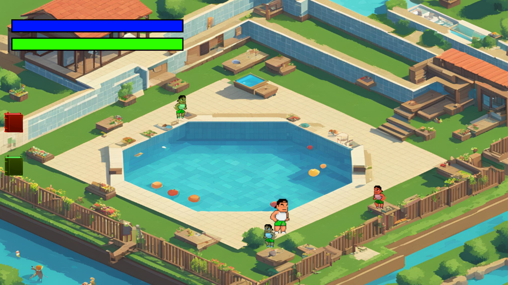
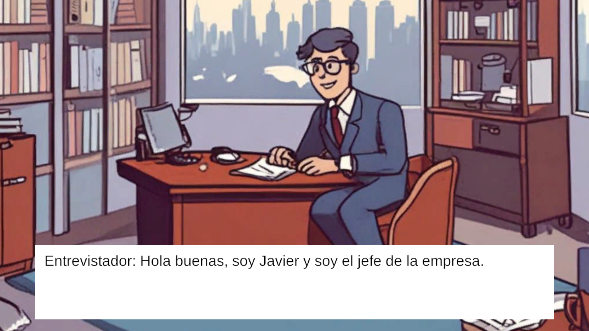
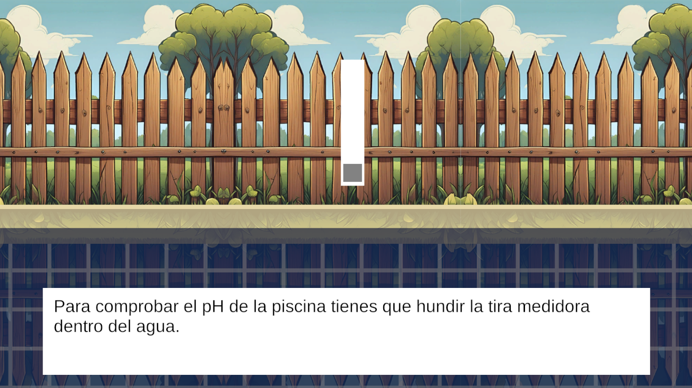

# Save a Life

**Save a Life** es un videojuego educativo interactivo diseñado para enseñar los principios fundamentales de socorrismo y primeros auxilios de manera divertida e inmersiva. En este juego asumes el papel de un socorrista novato que, a lo largo de una jornada de verano, debe aprender a mantener la piscina en buen estado mientras enfrenta situaciones de emergencia que ponen a prueba tus habilidades y conocimientos.

## 📖 Descripción General

El juego combina elementos narrativos y de simulación para ofrecer una experiencia pedagógica única, enfocada en la formación de habilidades prácticas. Es ideal tanto para estudiantes de socorrismo como para personas interesadas en aprender primeros auxilios de manera autodidacta.

- **Género:** Narrativo interactivo con mecánicas de gestión y simulación.
- **Público objetivo:** Personas mayores de 16 años interesadas en aprender o reforzar sus conocimientos en socorrismo.
- **Plataforma:** PC (Windows).

---

## 🎮 Características Clave

### Aprendizaje y Juego
- **Simulación educativa:** Realiza tareas prácticas como medir niveles de pH, ajustar cloro, realizar maniobras de RCP y manejar situaciones críticas.
- **Progresión narrativa:** Vive la experiencia de un socorrista a través de niveles con dificultad creciente y un enfoque en el aprendizaje progresivo.
- **Evaluación:** Completa evaluaciones antes y después del juego para medir tu avance en conocimientos de primeros auxilios.

### Mecánicas del Juego
- **Point and Click:** Mueve al personaje y realiza tareas clave con un sistema intuitivo de clics.
- **Minijuegos temáticos:** Incluyen simulaciones de emergencias reales como rescates en agua, aplicación de primeros auxilios y control del entorno.
- **Gestión y decisión:** Balancea tareas rutinarias y responde eficazmente a emergencias para mantener tu reputación con la comunidad y la empresa.

### Entorno y Personajes
- **Ambientación:** Una piscina comunitaria, recreada con detalles que reflejan el día a día de un socorrista.
- **Personajes dinámicos:** Desde bañistas en peligro hasta NPCs que interactúan contigo según tus decisiones.

---

## 🌍 Mundo de Juego

El juego se desarrolla en un entorno top-down que combina áreas interactivas como la piscina, la sala de mantenimiento y los alrededores. Cada nivel representa un día de trabajo donde tus decisiones afectan el desenlace y tu progreso profesional.

---

## 📚 Documentación Detallada

El diseño y desarrollo de **Save a Life** está respaldado por un completo [Documento de Diseño de Juego (GDD)](Assets/Documentation/SAVE A LIVE.pdf), que incluye:

1. **Historia y narrativa:** Desde el inicio humilde como socorrista novato hasta la posibilidad de ganarte el respeto de la comunidad.
2. **Mecánicas y jugabilidad:** Detalles sobre los niveles, minijuegos y evaluación de tus habilidades.
3. **Aspecto pedagógico:** Cómo se integra el aprendizaje práctico en la experiencia de juego.

---

## 📜 Licencia

El contenido de **Save a Life** está bajo la licencia de uso MIT.

https://www.canva.com/es_es/help/using-canva-to-create-products-for-sale/ // licencia de Canva frente al uso de su IA

EL resto de imagenes del proyecto son de la IA de Canva mezcladas con Artbreeder, por lo que solo se requiere la licencia de Canva para su uso.

¡Explora, aprende y salva vidas con **Save a Life**! 🚑
